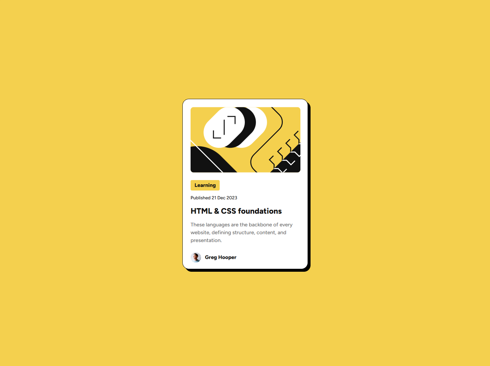

# Frontend Mentor - Blog preview card solution

This is a solution to the [Blog preview card challenge on Frontend Mentor](https://www.frontendmentor.io/challenges/blog-preview-card-ckPaj01IcS). 

## Table of contents

- [Overview](#overview)
  - [The challenge](#the-challenge)
  - [Screenshot](#screenshot)
  - [Links](#links)
- [My process](#my-process)
  - [Built with](#built-with)
  - [What I learned](#what-i-learned)
  - [Useful resources](#useful-resources)

## Overview

### The challenge

Users should be able to:
- See hover and focus states for all interactive elements on the page

### Screenshot

### Links

- Solution URL: [GitHub](https://github.com/rradiohysteria/blog-preview-card)
- Live Site URL: [GitHub Pages](https://rradiohysteria.github.io/blog-preview-card/)

## My process

### Built with

- Semantic HTML5 markup
- CSS custom properties
- Flexbox

### What I learned
I made the attempt twice, because the first time I thought I was being smart and was using flexbox in places I shouldn't have been using flexbox. When the different divs started overlapping, it was at that moment I knew I screwed up. Turns out, the one thing that needed to be changed was adding some padding to the card class and it was smooth sailing from there.
Made a little simple extra hover animation as well where the cover pops up.

### Useful resources

- [Reddit lol](https://www.reddit.com/r/css/comments/pftjfb/how_to_smoothly_transition_from_a_hover_to_a_non/) - Helped me figure out how to smooth a transition out between the initial state to hover and then back to initial state.
